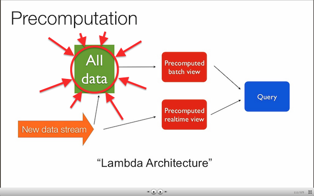

# alldata

_Stability: 1 - [Experimental](https://github.com/tristanls/stability-index#stability-1---experimental)_

AllData is a distributed master-less write-once immutable event store database implementing "All Data" part of [Lambda Architecture](http://www.slideshare.net/nathanmarz/runaway-complexity-in-big-data-and-a-plan-to-stop-it).

