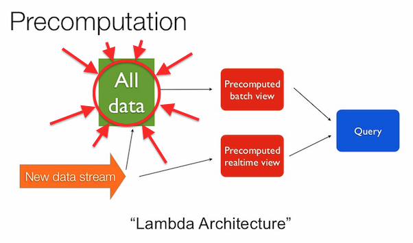

# alldata

_Stability: 1 - [Experimental](https://github.com/tristanls/stability-index#stability-1---experimental)_

AllData is a distributed master-less write-once immutable event store database implementing "All Data" part of [Lambda Architecture](http://www.slideshare.net/nathanmarz/runaway-complexity-in-big-data-and-a-plan-to-stop-it).

## Available Modules

### Clients

  * [alldata-client-http](https://github.com/tristanls/alldata-client-http): AllData HTTP client module

### Servers (for Clients)

  * [alldata-server-http](https://github.com/tristanls/alldata-server-http): AllData HTTP server module

### Peer Clients

  * [alldata-peer-client-http](https://github.com/tristanls/alldata-peer-client-http): AllData Peer HTTP client module

### Peer Servers (for Peer Clients)

  * [alldata-peer-server-http](https://github.com/tristanls/alldata-peer-server-http): AllData Peer HTTP server module

### Storage

  * [alldata-storage-leveldb](https://github.com/tristanls/alldata-storage-leveldb): AllData LevelDB-backed storage module

### Internal

  * [alldata-coordinator](https://github.com/tristanls/alldata-coordinator): AllData request coordinator module
  * [alldata-keygen](https://github.com/tristanls/alldata-keygen): AllData key generation module